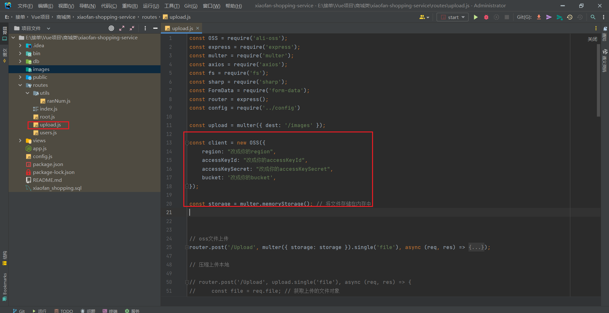

# 小帆购物商城后端

### 前台地址：https://gitee.com/LiFan2004/xiaofan-shopping
### 后台地址：https://gitee.com/LiFan2004/xiaofan-mall-shopping-background

## 项目介绍

小帆购物商城后端是一个基于Node.js的电商平台后端服务，支持用户注册登录、个人信息管理、购物车管理、收货地址管理、订单管理等功能。该项目采用了多种先进的技术栈，确保高效、稳定的运行。

**技术栈**
1. Node.js：提供高效、异步的服务器端运行环境。
2. Express：轻量级的Node.js Web应用框架，用于构建API和Web服务器。
3. Redis：高性能的内存数据库，用于缓存用户会话、购物车等数据，提高系统响应速度。
4. MySQL：关系型数据库管理系统，用于存储用户信息、商品信息、订单数据等。

**支付方式**
支付宝沙箱支付：采用支付宝沙箱环境进行支付功能测试，确保支付流程的可靠与安全。

# 功能模块

**用户模块**
* 注册登录：支持用户名/邮箱注册与登录，确保用户账号的安全性。
* 邮箱注册：提供邮箱验证功能，增加用户账号的可信度。

**个人信息模块**
* 支持用户查看和编辑个人信息，包括头像、昵称、联系方式等。
* 购物车模块
* 实现商品的添加、删除、修改数量等操作，支持用户查看购物车商品列表。
* 收货地址模块
* 用户可以添加、删除、编辑收货地址，便于订单配送。
* 订单管理模块
* 用户可以查看订单状态、历史订单、订单详情等。
* 提供订单支付、取消等功能。

**后台管理员模块**

* 用户管理：管理用户账号，包括用户审核、禁用/启用用户等。
* 商品管理：添加、删除、编辑商品信息，上下架商品。
* 订单管理：查看所有订单，处理订单异常，统计订单数据。
* 订单数据分析：提供订单数据分析报表，为商城运营提供决策支持。

# 修改阿里云OSS镜像上传配置

如果没有将第一个Upload注释解开本地上传